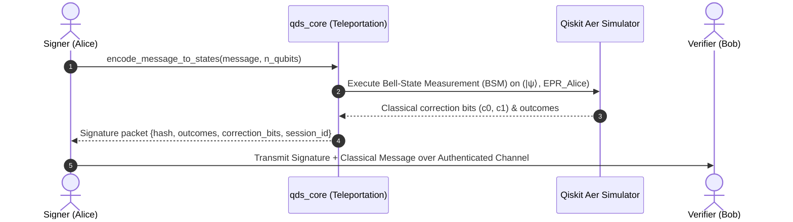
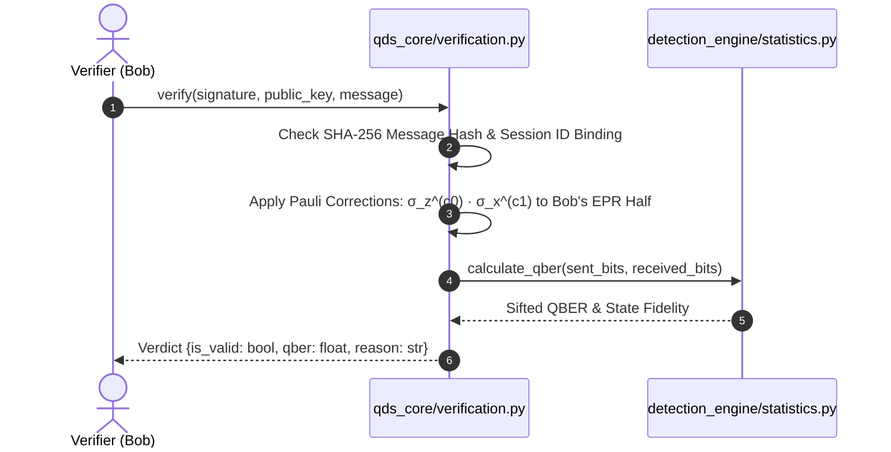
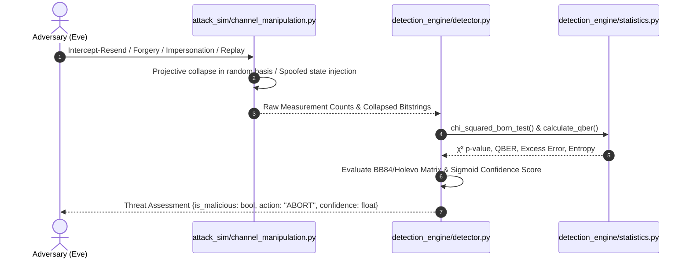
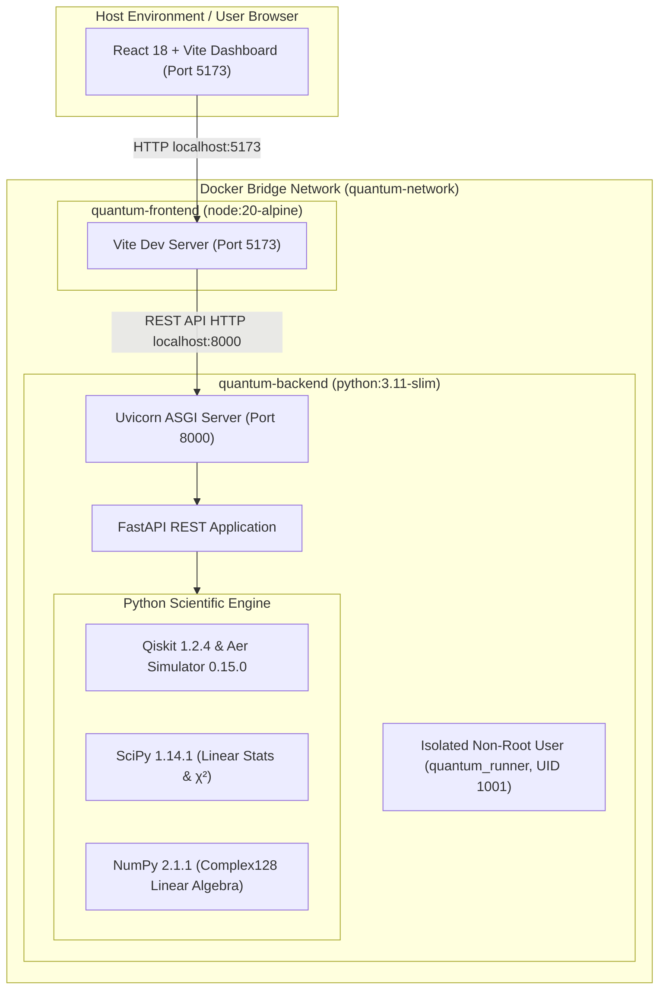

# Architecture — QDS Threat Detection Framework

## Overview

This document describes the production architecture of the
**Quantum-Inspired Cyber Threat Detection Framework for Teleportation-Based
Quantum Digital Signatures (QDS)**.

The system is split into four logical layers:

```
┌─────────────────────────────────────────────────────┐
│                  React Dashboard                     │
│          (Vite · port 5173 · Docker)                 │
└───────────────────────┬─────────────────────────────┘
                        │ HTTP / REST (JSON)
┌───────────────────────▼─────────────────────────────┐
│               FastAPI Backend                        │
│          (Python 3.11 · port 8000 · Docker)         │
├──────────────┬──────────────┬────────────────────────┤
│  qds_core    │  attack_sim  │  detection_engine       │
│  (Qiskit)    │  (Qiskit)    │  (numpy / scipy)        │
└──────────────┴──────────────┴────────────────────────┘
```

---

## 1. Signing Sequence Diagram



---

## 2. Verification Sequence Diagram



---

## 3. Attack & Detection Sequence Diagram



---

## 4. Production Deployment Topology



---

## 5. Security & Boundary Classification

| Metric | Safe Condition | Warning Condition | Compromised Condition |
|---|---|---|---|
| **QBER** | $< 5.0\%$ | $5.0\% - 11.0\%$ | $> 11.0\%$ (BB84 Limit) |
| **χ² $p$-value** | $> 0.05$ | $0.01 - 0.05$ | $< 0.01$ (Distribution Skew) |
| **State Fidelity** | $> 90.0\%$ | $70.0\% - 90.0\%$ | $< 70.0\%$ |
| **Confidence** | $< 0.30$ | $0.30 - 0.50$ | $> 0.50$ (`is_malicious = True`) |
| **Action** | `NONE` | `ALERT` | `ABORT` (Channel Tear-Down) |
